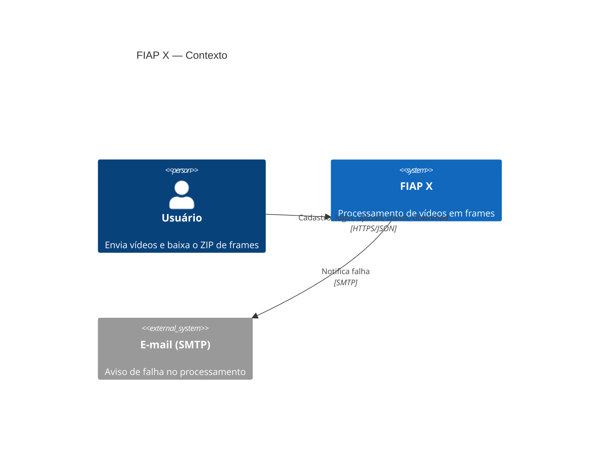
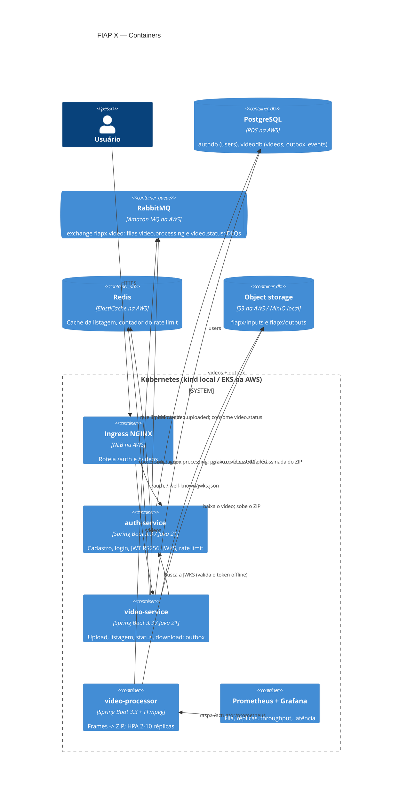
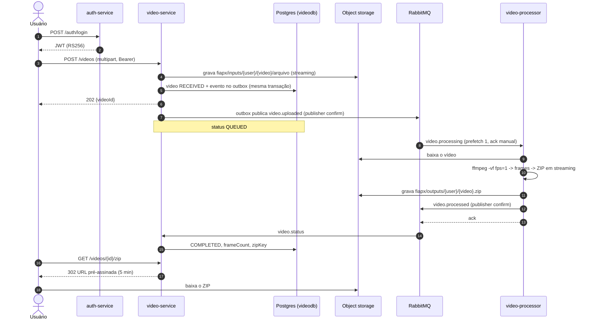
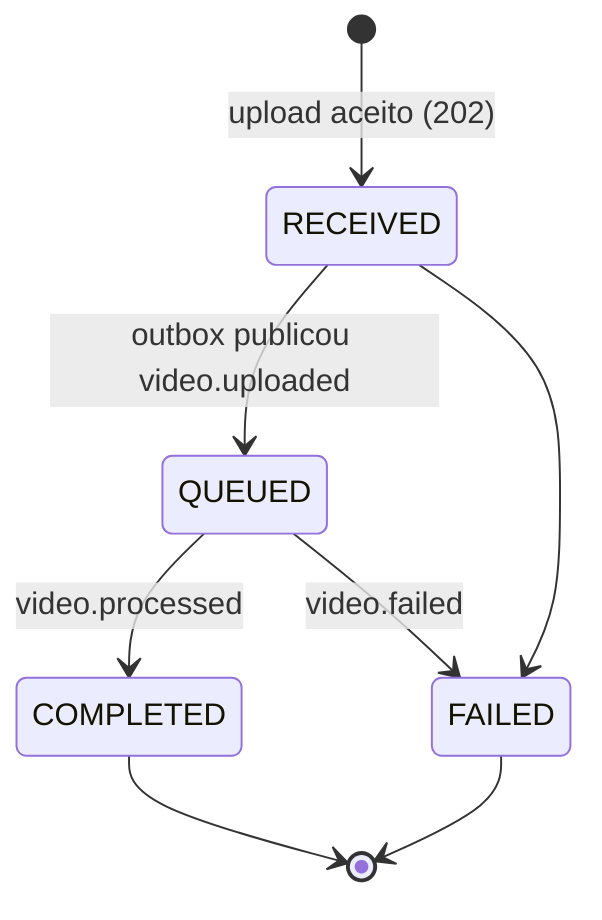

# Arquitetura — FIAP X (DOC-1)

Sistema que recebe vídeos, extrai os frames e devolve um `.zip`, com processamento
assíncrono, escala horizontal e nenhuma requisição aceita perdida.

- Decisões: [ADR-001](../adr/ADR-001-stack-local-kind-rabbitmq-minio.md) (stack local) e
  [ADR-002](../adr/ADR-002-alvo-aws-learner-lab.md) (AWS).
- Banco: [`database/schema.sql`](../database/schema.sql).
- Subir o ambiente: repo `infra` (`make up` local, `scripts/aws-up.sh` na AWS).

---

## C4 — Contexto

## C4 — Containers

---

## Fluxo de um vídeo

## Estados de um vídeo

---

## Requisitos do enunciado → como são atendidos

| Requisito | Como |
|---|---|
| Processar mais de um vídeo ao mesmo tempo | Worker desacoplado por fila; HPA de 2 a 10 réplicas, `prefetch=1` distribui a carga |
| Não perder requisição em pico | Upload grava vídeo + evento na mesma transação (outbox); publisher confirms; ack manual só depois do resultado confirmado; DLQ. Teste k6: 50 uploads simultâneos, 0 perdidos |
| Protegido por usuário e senha | auth-service: Argon2id + pepper, JWT RS256, rate limit de login no Redis |
| Listagem de status por usuário | `GET /videos` paginado e escopado ao `sub` do token (vídeo de outro usuário → 404) |
| Notificação em caso de erro | Evento `video.failed` → e-mail (Mailhog local) — **PLT-8 em andamento** |
| Persistir os dados | PostgreSQL (RDS na AWS), migrations Flyway |
| Arquitetura escalável | Kubernetes, HPA, serviços stateless, fila entre upload e processamento |
| Testes | JUnit + Testcontainers nos 3 serviços, gate JaCoCo; E2E no `verify.sh`; carga com k6 |
| CI/CD | GitHub Actions: CI por repo; CD com build, kind efêmero e smoke test; Terraform validado no Floci |
